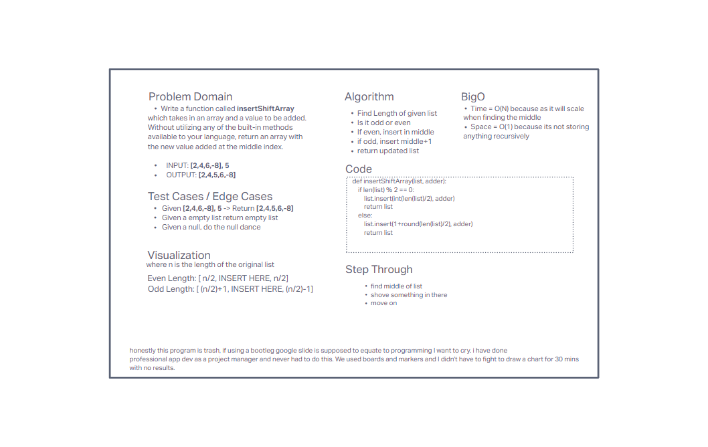

# Insert to Middle of an Array
<!-- Description of the challenge -->
Write a function called insertShiftArray which takes in an array and a value to be added. Without utilizing any of the built-in methods available to your language, return an array with the new value added at the middle index.

## Whiteboard Process
<!-- Embedded whiteboard image -->

## Approach & Efficiency
<!-- What approach did you take? Discuss Why. What is the Big O space/time for this approach? -->
The approach I took was using the len command to find the length, once there I used an if statement to handle the cases where it is of even or odd length. If even stick it at the len/2 location. If odd move that one to the right.
