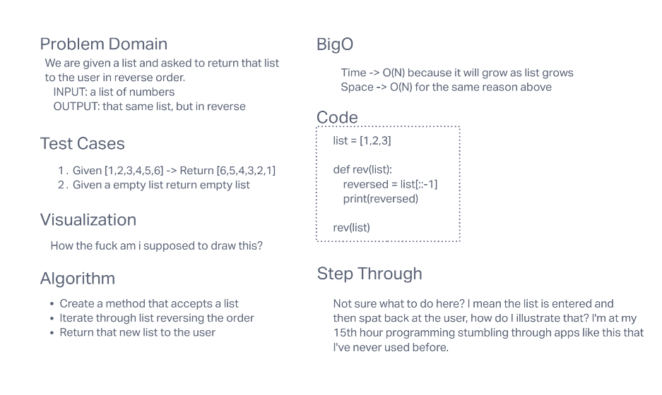

# Reverse an Array
<!-- Description of the challenge -->
given an list, return to the user its reverse

## Whiteboard Process
<!-- Embedded whiteboard image -->

## Approach & Efficiency
<!-- What approach did you take? Discuss Why. What is the Big O space/time for this approach? -->
I have no clue, its almost 11 pm and because of stuff completely outside my control i'm already puttin in a 14 hour day
