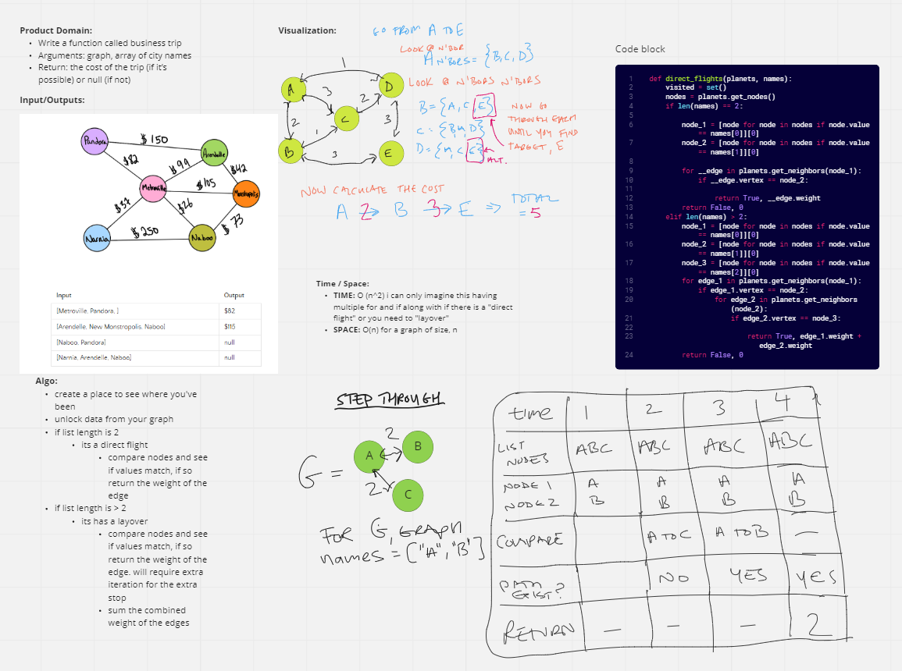

# Challenge Summary
<!-- Description of the challenge -->
Problem Domain:

## Whiteboard Process
<!-- Embedded whiteboard image -->

## Approach & Efficiency
<!-- What approach did you take? Why? What is the Big O space/time for this approach? -->
Approach:
- create a place to see where you've been
- unlock data from your graph
- if list length is 2
  - its a direct flight
  - compare nodes and see if values match, if so return the weight of the edge
- if list length is > 2
  - its has a layover
  - compare nodes and see if values match, if so return the weight of the edge. will require extra iteration for the extra stop
  - sum the combined weight of the edges

Space and Time:
TIME: O (n^2) i can only imagine this having multiple for and if along with if there is a "direct flight" or you need to "layover"
SPACE: O(n) for a graph of size, n

## Solution
<!-- Show how to run your code, and examples of it in action -->

just `pytest teat/test_graph_business_trip.py`
