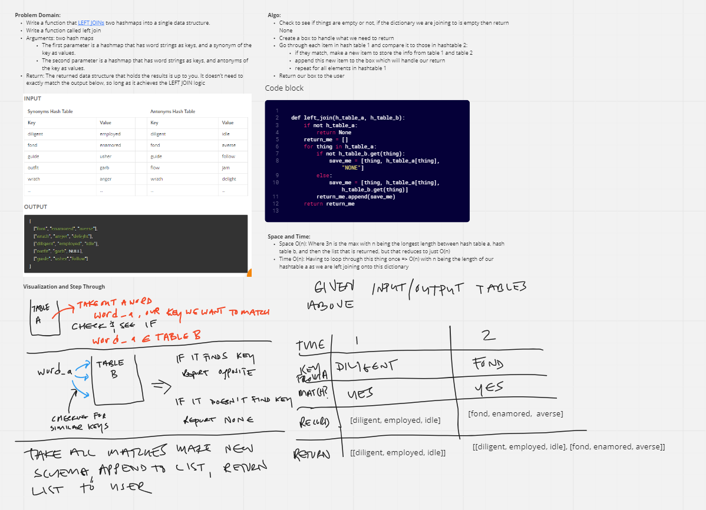

# Challenge Summary
<!-- Description of the challenge -->
Problem Domain:
Write a function that LEFT JOINs two hashmaps into a single data structure.
Write a function called left join
Arguments: two hash maps
The first parameter is a hashmap that has word strings as keys, and a synonym of the key as values.
The second parameter is a hashmap that has word strings as keys, and antonyms of the key as values.
Return: The returned data structure that holds the results is up to you. It doesn’t need to exactly match the output
below, so long as it achieves the LEFT JOIN logic

## Whiteboard Process
<!-- Embedded whiteboard image -->

## Approach & Efficiency
<!-- What approach did you take? Why? What is the Big O space/time for this approach? -->
Space and Time:
Space O(n): Where 3n is the max with n being the longest length between hash table a, hash table b,
and then the list that is returned, but that reduces to just O(n)
Time O(n): Having to loop through this thing once => O(n) with n being the length of our hashtable a as
we are left joining onto this dictionary

## Solution
<!-- Show how to run your code, and examples of it in action -->

just `pytest teat/test_hashable_left_join.py`
