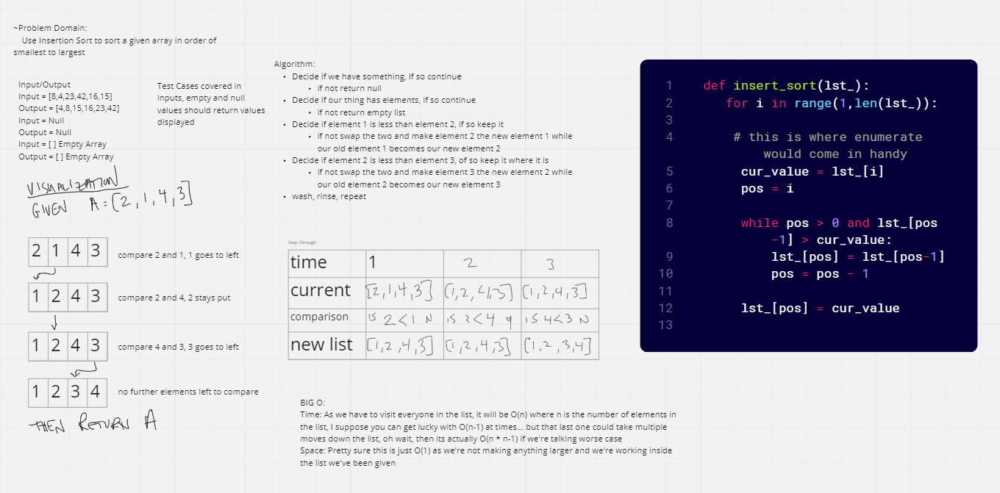

# Challenge Summary
<!-- Description of the challenge -->
to sort an array based on the insertion sort method and not rage-quit and punch my computer
when given garbage instructions and return a sorted array based

## Whiteboard Process
<!-- Embedded whiteboard image -->

## Approach & Efficiency
<!-- What approach did you take? Why? What is the Big O space/time for this approach? -->
I iterated through the list in the fashion shown in the pseudocode per instructions
- Time - O(n * n -1)
- Space = O(1)
## Solution
<!-- Show how to run your code, and examples of it in action -->

given:
a = [3, 2, 1]
then:
print(insert_sort(a))
will output:
[1, 2, 3]
