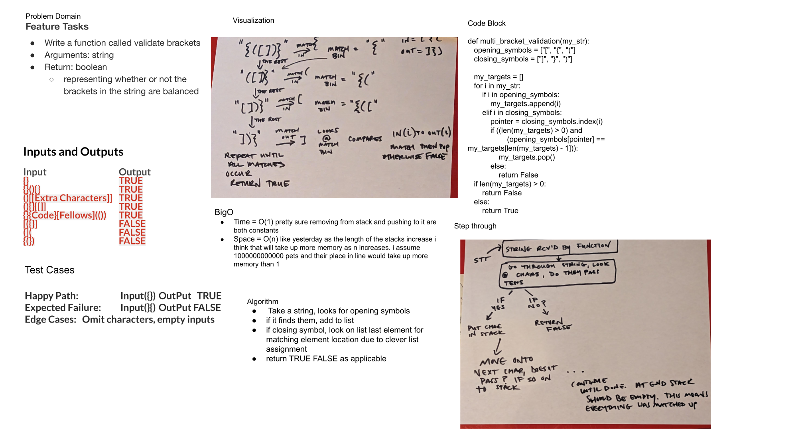

# Challenge Summary
<!-- Description of the challenge -->
Write a function called validate brackets
Arguments: string
Return: boolean
representing whether or not the brackets in the string are balanced
## Whiteboard Process
<!-- Embedded whiteboard image -->

## Approach & Efficiency
<!-- What approach did you take? Why? What is the Big O space/time for this approach? -->
i chose to save my opening brackets in a bucket, seeing if the closing brackets align with their opening cousins,
if so removing them as needed and returning logic appro. the situation

## Solution
<!-- Show how to run your code, and examples of it in action -->
i have no idea, you run it in pytest? but i'm not sure what directory you're in,
can we get some feed back on what this means?
