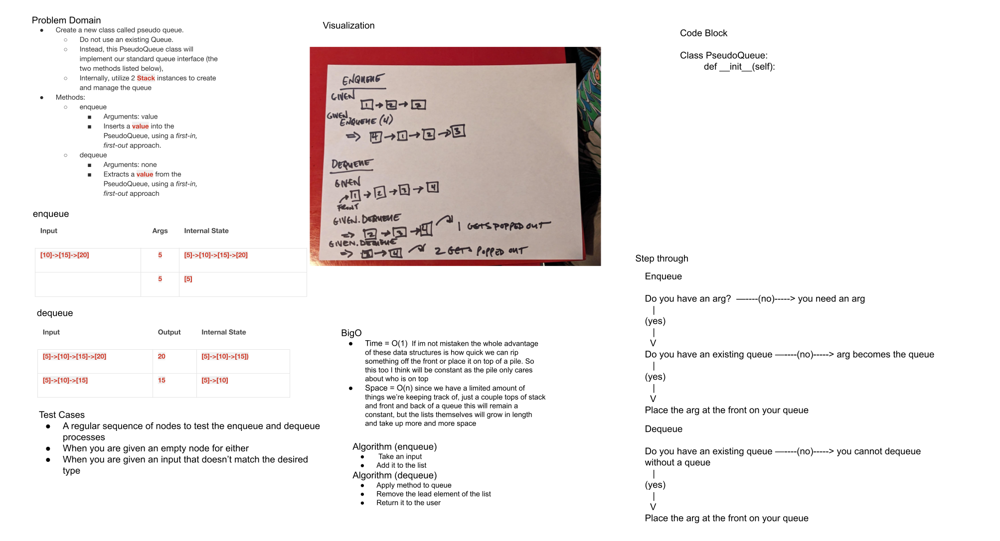

# Challenge Summary
<!-- Description of the challenge -->

Create a new class called pseudo queue.
Do not use an existing Queue.
Instead, this PseudoQueue class will implement our standard queue interface (the two methods listed below),
Internally, utilize 2 Stack instances to create and manage the queue
Methods:
enqueue
Arguments: value
Inserts a value into the PseudoQueue, using a first-in, first-out approach.
dequeue
Arguments: none
Extracts a value from the PseudoQueue, using a first-in, first-out approach.

## Whiteboard Process
<!-- Embedded whiteboard image -->

so glad this is getting posted to github, im SO SO SOOOO proud of it

## Approach & Efficiency
<!-- What approach did you take? Why? What is the Big O space/time for this approach? -->

um i didn't write any code, doing the whiteboard took me five hours

## Solution
<!-- Show how to run your code, and examples of it in action -->

i dont have a solution, my time was pissed away doing a whiteboard
