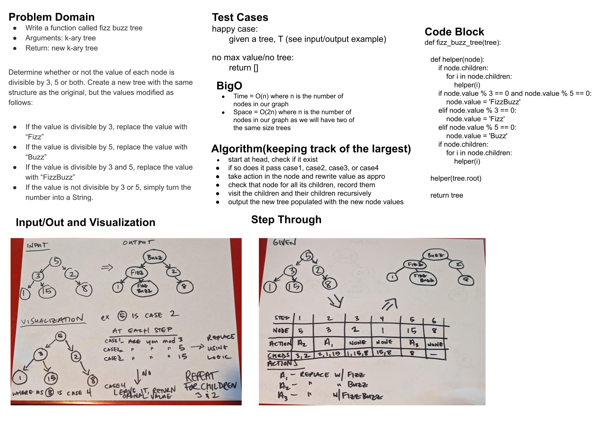

# Challenge Summary
<!-- Description of the challenge -->

Write a function called fizz buzz tree
Arguments: k-ary tree
Return: new k-ary tree
Determine whether or not the value of each node is divisible by 3, 5 or both. Create a new tree with the same structure as the original, but the values modified as follows:

If the value is divisible by 3, replace the value with “Fizz”
If the value is divisible by 5, replace the value with “Buzz”
If the value is divisible by 3 and 5, replace the value with “FizzBuzz”
If the value is not divisible by 3 or 5, simply turn the number into a String.

## Whiteboard Process
<!-- Embedded whiteboard image -->

## Approach & Efficiency
<!-- What approach did you take? Why? What is the Big O space/time for this approach? -->

I walked through, looked at my nodes and their children and then made annotations as I went so i wouldnt have to retraverse the tree again
Copied from my whiteboard: "Time = O(n) where n is the number of nodes in our graph
Space = O(2n) where n is the number of nodes in our graph as we will have two of the same size trees
"

## Solution
<!-- Show how to run your code, and examples of it in action -->
the TAs nor the working code from the professor would make my program run. people smarter than i are now looking at it trying to see what the problem is.
`pytest tests/code_challenges/test_fizz_buzz.py`
