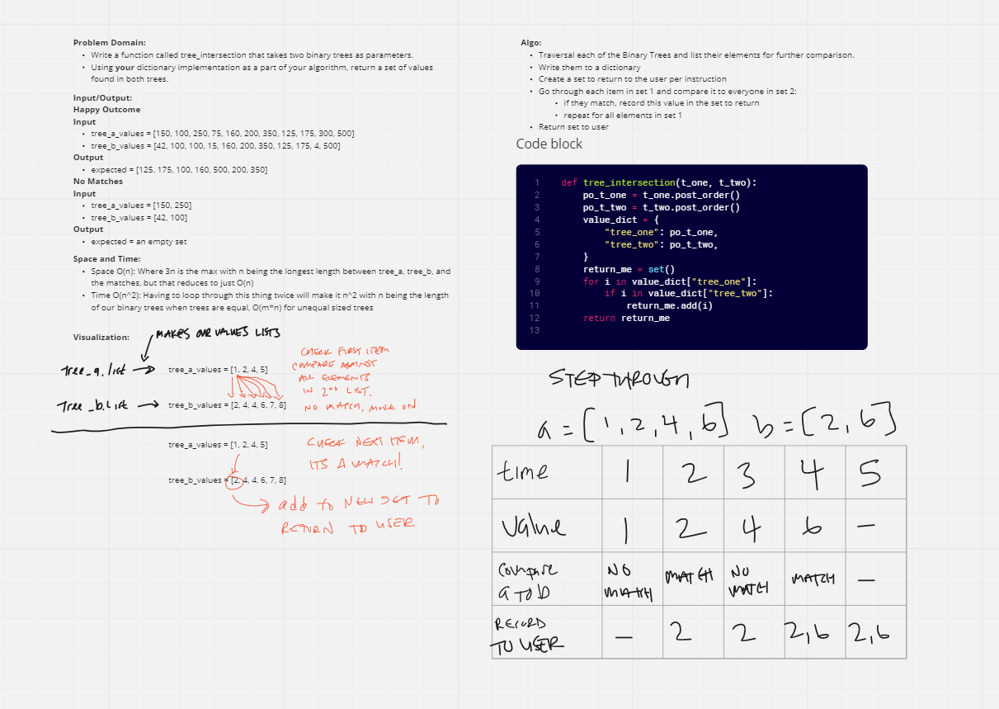

# Challenge Summary
<!-- Description of the challenge -->
Problem Domain:
Write a function called tree_intersection that takes two binary trees as parameters.
Using your dictionary implementation as a part of your algorithm, return a set of values found in both trees.

## Whiteboard Process
<!-- Embedded whiteboard image -->

## Approach & Efficiency
<!-- What approach did you take? Why? What is the Big O space/time for this approach? -->

### Space and Time:
Space O(n): Where 3n is the max with n being the longest length between tree_a, tree_b, and the matches, but that reduces to just O(n)
Time O(n^2): Having to loop through this thing twice will make it n^2 with n being the length of our binary trees when trees are equal, O(m*n) for unequal sized trees

### Algo:
Algo:
Traversal each of the Binary Trees and list their elements for further comparison.
Write them to a dictionary
Create a set to return to the user per instruction
Go through each item in set 1 and compare it to everyone in set 2:
if they match, record this value in the set to return
repeat for all elements in set 1
Return set to user

## Solution
<!-- Show how to run your code, and examples of it in action -->
just `pytest teat/test_tree_intersection.py`
