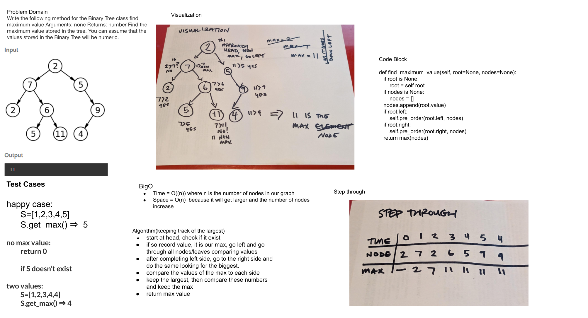

# Challenge Summary
<!-- Description of the challenge -->

Write the following method for the Binary Tree class
- Find maximum value
- Arguments: none
- Returns: number
- Find the maximum value stored in the tree. You can assume that the values stored in the Binary Tree will be numeric.

## Whiteboard Process
<!-- Embedded whiteboard image -->

## Approach & Efficiency
<!-- What approach did you take? Why? What is the Big O space/time for this approach? -->

I walked through this the same way I did one of my sorts but returned the max instead of a sorted array.
Originally I tried to do a different approach and kept it for future ponderings.

## Solution
<!-- Show how to run your code, and examples of it in action -->

`pytest tests/code_challenges/test_tree_max.py`
