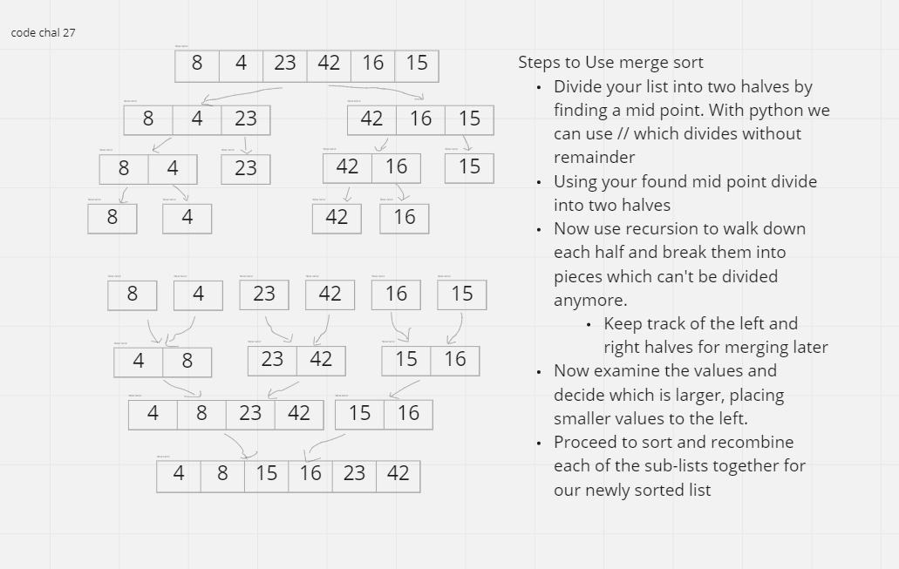

# Challenge Summary
<!-- Description of the challenge -->
Review the pseudocode below, then trace the algorithm by stepping through the process with the provided sample array. Document your explanation by creating a blog article that shows the step-by-step output after each iteration through some sort of visual.
Once you are done with your article, code a working, tested implementation of Merge Sort based on the pseudocode provided.

## Whiteboard Process
<!-- Embedded blog post image -->

## Approach & Efficiency
<!-- What approach did you take? Why? What is the Big O space/time for this approach? -->
I iterated through the list in the fashion shown in the pseudocode per instructions
- Time - O(n * log n)
- Space = O(1)
## Solution
<!-- Show how to run your code, and examples of it in action -->

given:
a = [8, 4, 23, 42, 16, 15]
then:
print(merge_sort(a))
will output:
[4, 8, 15, 16, 23, 42]
