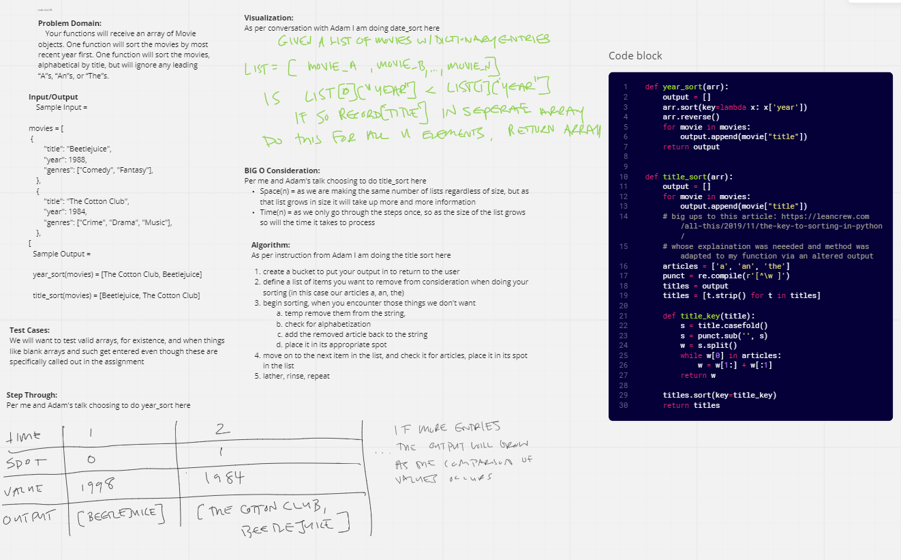

# Challenge Summary
<!-- Description of the challenge -->
Your functions will receive an array of Movie objects. One function will sort the movies by most recent year first.
One function will sort the movies, alphabetical by title, but will ignore any leading “A”s, “An”s, or “The”s.
## Whiteboard Process
<!-- Embedded blog post image -->

## Approach & Efficiency
<!-- What approach did you take? Why? What is the Big O space/time for this approach? -->
I iterated through the list to take appropriate sorting steps at each place
- Time - O(n^2) - on my whiteboard i said O(N) i meant N^2 as best case is O(N) but i forgot to consider the bad cases
- Space - O(n) - we will be making a constant number of objects each time, yet those will grow in size as n grows
## Solution
<!-- Show how to run your code, and examples of it in action -->

given:
movies = [
    {
        "title": "Beetlejuice",
        "year": 1988,
        "genres": ["Comedy", "Fantasy"],
    },
    {
        "title": "The Cotton Club",
        "year": 1984,
        "genres": ["Crime", "Drama", "Music"],
    },
    {
        "title": "The Shawshank Redemption",
        "year": 1994,
        "genres": ["Crime", "Drama"],
    },
    {
        "title": "Crocodile Dundee",
        "year": 1986,
        "genres": ["Adventure", "Comedy"],
    }
]

then:
print(year_sort(movies))
will output:
["The Shawshank Redemption", "Beetlejuice", "Crocodile Dundee", "The Cotton Club"]

and

print(title_sort(movies))
will output:
["Beetlejuice", "The Cotton Club", "Crocodile Dundee", "The Shawshank Redemption"]
